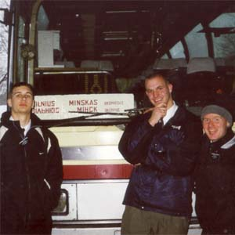

[\<- Back](../index.html)  
  
  
  
  
My name is Chris Marchant, I am from [Rochester, New
York](http://www.monroecounty.gov/), and yes, I am an American.  Like
most Americans, I have mixed ancestry, but to the best of my knowledge,
not a single one of my ancestors emigrated to the United States from
Eastern Europe, let alone Belarus or Russia.  In high school, I signed
up for French because I was required to take a language, and I hated it
thoroughly, and even failed it one year.  I have always loved science
and technical things, so when I started college at [Brigham Young
University](http://www.byu.edu), I declared my major to be [Electrical
Engineering](http://www.ee.byu.edu).  As of March 11th, 1999, the only
Russian phrase that I knew was "dah sveedanyah" and I thought it meant
'hello'.  That Wednesday, at 2:00pm, I entered the [Provo Missionary
Training Center](http://mtc.byu.edu) as a missionary for the [Church of
Jesus Christ of Latter-day Saints](http://www.lds.org).  
  
    I am a member of the [Church of Jesus
Christ of Latter-day Saints](http://www.lds.org), also known as "[the
Mormons](http://www.mormon.org)."  I believe very sincerely certain
things, including that God loves us personally and answers our prayers,
that God still gives us revelation through prophets, and that we are
happy when we know that our lives are in line with God's will.  After my
first semester of college, I volunteered to be a full-time missionary
for the Church.  I took a deferrance from my university, my family
agreed to pay for my support while I would be gone, and the Church asked
me to serve a mission preaching the Gospel in
[Lithuania](http://www.lietuva.lt/).  As a missionary, I received no
compensation other than the spiritual kind.  
  
   
Most of the missionaries the Church sends to
[Lithuania](http://www.lietuva.lt/) learn to speak
[Lithuanian](http://postilla.mch.mii.lt/Kalba/kalbarast.en.htm) (of
course), but as there are significant Polish and Russian minorities, I
was asked to learn
[Russian](http://en.wikipedia.org/wiki/Russian_language).  I spent two
months in the states receiving 6 hours of intensive language instruction
daily.  This was not really enough but one cannot ride with training
wheels forever and I was sent off to Lithuania.  I love and miss
Lithuania.  I miss how people would tell us they were not interested in
talking about religion, but would still invite us in to offer us cookies
and kvass on a hot summer day.  I miss the way little kids would try to
teach us Lithuanian.  I miss
[Uzupis](http://www.glasssteelandstone.com/BuildingDetail.php?ID=183),
rokiskio cheese and the little chocolate cupcakes you can buy in
Vilnius.  
  
    During my time in Lithuania, I learned to speak Russian passably.  I
learned my grammar by reading a [grammar
reference](http://www.bris.ac.uk/Depts/Russian/russstaffresearch.html#Offord)
I had been given while still in the states, and I learned vocabulary by
talking to people and looking up words I didn't know in the dictionary
(if I could remember them).  It was a little difficult to read Russian
because I saw it so little.  There were several words, like
'barbershop', that I knew in Lithuanian, but not in Russian.  There were
other oddities in my Russian.  I knew, for example, what 'khloptsy'
were, but not 'parny.'  Lithuanians would get upset when I spoke Russian
with them.  They would ask why I would not learn Lithuanian since I was
in Lithuania.  It is rude to come to someone's country, to ask to speak
with them, and then to ask them to speak with you in a foreign tongue.  
  
    I had been in Lithuania for a year,
when I was asked to serve in [Belarus](http://www.belarusguide.com/).  I
had heard stories about the country from other missionaries who had come
back from there and was... excited.  I knew it was a lot poorer than
Lithuania, a lot more dangerous, and most ominous of all, that it was a
[dictatorship](http://news.bbc.co.uk/1/hi/world/europe/country_profiles/1102180.stm#leaders),
unfriendly to the west.  
  
    In
[Belarus](http://www.cia.gov/cia/publications/factbook/geos/bo.html),
there is a law that a religious organization can only have missionaries
if it has national registration.  National registration is essentially
impossible to obtain, even if an organization fulfills the requirements
of the law, the bureaucracy will stonewall the religion's efforts to
obtain recognition.  [Russian Orthodoxy](http://www.mospat.ru/) and
[Roman Catholicism](http://www.catholic.org/) are nationally recognized
by the government, but not other religions.  Because of this, when I
went to Belarus, I did not go as a missionary, but as a humanitarian aid
worker.  I was a representative of the International Charitable Public
Association "Sofia."  I did not represent the Church, I did not carry a
missionary name-tag, I never introduced myself as a missionary.  If,
during conversation, a Belarusian brought up the topic of religion, I
would discuss it with him, but I would never bring it up on my own.  
  
  
  
    I spent nine months living in the city of
[Vitebsk](http://www.vitebsk.net/), with three other Americans.  The
organization we did work for, "Sophia", would occationally receive
shipments of clothing and food from the states and if that happened we
were to help verify that it was distributed properly, but for some
reason, the shipments were held up for many months.  The main work that
we were supposed to do was to present assemblies in elementary schools. 
We would put on puppet shows acting out situations involving tobacco and
alchohol and we would discuss the scenes with the kids.  The guys in
[Minsk](http://www.inyourpocket.com/belarus/minsk/en/) would do this
every day, but although we technically had permission to put on the
assemblies in Vitebsk schools, the bureaucracy would stonewall us and we
were unable to.  
  
    When I first entered Belarus, I was fascinated because everywhere
there were signs in
[Belarusian](http://www.belarus-misc.org/bel-ling.htm).  It was first of
all wierd to see cyrillic, but more than that I could not understand
many of the words, and the endings on the words did not make sense. 
During my nine months in Vitebsk, because there was no work for us, the
only thing for us to do was hang out with the locals.  I spent a lot of
time with a small family, the Gusakovy.  The
mother, Larisa, was very kind to us.  She essentially was my mother
while we stayed there.  Her son Ilya was a terror and the first time he
met anyone, he would try to punch them in the crotch.  Little Liza was
just adorable, I miss her.  She was only 3 and had trouble saying my
name, she would call me 'Masan', and after I left, she would call all
the Americans 'Masan.'  
  
    Larisa had been a teacher of Belarusian before she had kids, and I
think that's what first get me wanting to learn Belarusian.  There was
this old man, we called him "Dedushka", to this day we don't know his
real name, and we would go out to his village and help him work out
there.  He had nine goats and the milk he got from them was very good,
much better than the nasty stuff one could buy in the store.  It was
very difficult for me to understand him because he always spoke in
'trasyanka', a mix of Russian and Belarusian.  
  
    This one time, Dave Beck somehow came into contact with this TV
reporter, a young women in her twenties, and she wanted to interview him
for a piece on the news.  I met her later and was talking to her and I
noticed that her grammar wasn't quite right, and I asked her about it. 
She admitted that at home she spoke Belarusian.  I had always before
this assumed that Belarusian was only spoken by old folks in the
villages, but here was a young person who preferred Belarusian, speaking
it home.  That is when I knew that Belarusian had not died yet.  
  
    I was uprooted from Belarus and asked to spend the last three months
of my mission in Yaraslavl, Russia.  It was heartbreaking to leave
Vitebsk.  I cried when I got on the train.  My accent had changed, it
was hard to say "mnoga" instead of "mnoha."  I missed the Gusakovy
really bad.  In Russia though, I was able to wear my nametag again and
be a missionary.  That felt really good.  
  
    After I returned from my mission, there were a few months before the
start of the next semester when I could go back to school.  I read a
book about [James
Murray](http://www.bikwil.zip.com.au/Vintage08/James-Murray.html) and
the creation of the [Oxford English Dictionary](http://www.oed.com/). 
The biggest obstacle to the creation of the dictionary was creating an
exhaustive list of every word in the language together with illustrative
examples of its usage.  I returned to college and I was taking this
computer science class on data structures, and while I was falling
asleep one night, I had a realization that I could make a computer
program that would catalogue the entire Belarusian language for me.  I
wrote the program the next summer and now I have a
[concordance](../concordance/concordance.html) containing virtually
every word in the Belarusian language, with usage.  
  
    It is beyond my abilities to create a dictionary out of this
[monsterous concordance](../concordance/concordance.html).  There are
simply too many words, and the fact is that my belarusian is not even
close to good enough for me to do it.  I was able to use it to create a
grammar guide.  The concordance shows me how common a word is so I was
able to determine the definitive formation of words.  I wrote
[Fundamentals of Modern
Belarusian](../fofmb/fofmb.html), my friend Hanna Badruseva
helped correct it, and then I received a grant from [Brigham Young
University](http://www.byu.edu) to go to Belarus to finish it.  There,
Valentsina Rusak, a professor of Belarusian at the National Academy of
Sciences, thoroughly went over the guide, correcting it as best as she
could.  Now it is posted here.  As an electrical engineer, I believe in
the power of
[open-source](http://www.gnu.org/licenses/licenses.html#TOCFDL). 
[Fundamentals of Modern
Belarusian](../fofmb/fofmb.html) is free.  Anyone may change,
improve or redistribute it, even for profit (if they can find someone
willing to pay, HAH\!)  The concordance is also distributed as
open-source.  It is beyond me to create an entire dictionary out of it,
but if others participate, it is possible to create a complete,
definitive, and free Belarusian-English dictionary.  
  
    Currently, I am attending [Utah State
University](http://www.usu.edu/), where I am getting my doctorate degree
in [Electrical Engineering](http://www.sdl.usu.edu/).  
  
  
[\<- Back](../index.html)  
  
  
  
  
[  
  
  
  
](mailto:vitbich@vitba.org)

[Email me at vitbich@vitba.org](mailto:vitbich@vitba.org)  

