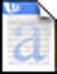

[](introduction.html)  

  

An open-source grammar guide to the Belarusian Language  

  
    The copyright to this text is held by Christian C. Marchant, 2004. 
This text is released under the GNU Free Documentation License, and may
only be redistributed in accordance with said license.  
  

Select a format:  
  

<table>
<colgroup>
<col style="width: 25%" />
<col style="width: 25%" />
<col style="width: 25%" />
<col style="width: 25%" />
</colgroup>
<tbody>
<tr class="odd">
<td style="text-align: center;"> 
</td>
<td style="text-align: center;"> 
</td>
<td style="text-align: center;"> 
</td>
<td style="text-align: center;"> 
</td>
</tr>
<tr class="even">
<td style="text-align: center;"><a href="introduction.html">HTML</a> 
</td>
<td style="text-align: center;"><a href="fofmb.pdf">PDF</a> 
</td>
<td style="text-align: center;"><a href="fofmb.doc">DOC</a> 
</td>
<td style="text-align: center;"><a href="fofmb.rtf">RTF</a> 
</td>
</tr>
</tbody>
</table>

  

  

    I am very excited that people are interested in Fundamentals of
Modern Belarusian.  Feel free to download, modify, and redistribute it. 
Please take note, however, that you must do so in accordance with the
the [GNU Free Documentation License](gnufreedl.html).  This means if you
redistribute it, you must provide a copy in an "open" format, like RTF
or HTML.  DOC and PDF do NOT qualify.  If you modify or make additions
to Fundamentals of Modern Belarusian, said changes and additions will
also be covered by the [GNU Free Documentation
License](gnufreedl.html).  
  
Please feel free link to this page, but please do not link directly to
the files.  
  
[\<- Back](../)   
  
  
 
