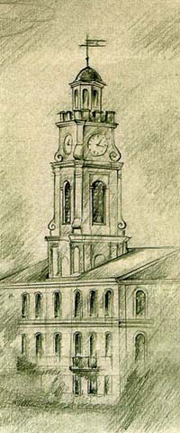

[Fundamentals of Modern Belarusian](fofmb/fofmb.html).  

| [Fundamentals of Modern Belarusian](fofmb/fofmb.html) |
| [Concordance](concordance/concordance.html) |
| [Culture](culture/culture.html) |
| [About Chris Marchant](aboutthe/chris_marchant.html) |

Chris Marchant wrote a  Belarusian concordance fetcher based on [knihi.com](http://www.knihi.com/).
  
  
09/18/04 : Uploaded the rest of the transcriptions (Culture section), added their translations.  [Pretty](culture/transcriptions/dzyonnik_5_brygady/lyric_lyonya.html),
[interesting](culture/transcriptions/dzyonnik_5_brygady/text_4.html) [ones](culture/transcriptions/dzyonnik_5_brygady/vyalikaya_vobryna_village.html), so [check it
out](culture/transcriptions/dzyonnik_5_brygady/fifth_brigade.html)\!  
09/02/04 : Typed up the transcriptions given by Prof. Rusak, uploaded them (Culture section), probable mistakes.

### Last updates

08/17/04 : Concordance filled out and uploaded, still pretty raw. FofMB converted to HTML.
02/18/04 : FofMB, corrections.
02/09/04 : FofMB, corrections.

Next steps: 
  - Add pronunciation section;
  - Add book of exercises;
  - Make a dictionary from concordance;
  - Proofread transcriptions.
  - Post the entire concordance
  - Post audio. 
