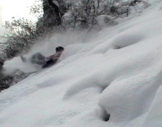
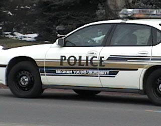
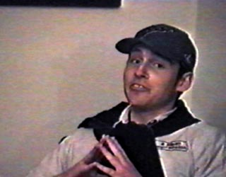

THUGGGS PRODUCTIONS  
Films by the Garvs of Oakwood \#1  
  

    My old roommates and I really liked making home-movies.  
  
  
  

  
  
[  
  
XTRYME SLEDDING](xtryme.mov)  
  
    This is my favorite, a mockumentary about the up-and-coming sport of
Extreme Sledding.  We really like the movie "Best in Show" and wanted to
make a mockuementary.  We shot this movie on in January '04.  Ryan and
Devin came up with the idea for extreme sledding the month before after
coming back home from saucering.  We borrowed heavily from Rocky IV for
some of the themes.  
  
  
[  
  
COPS: BYU](fhe_small.mov)  
  
    Another film that we made later.  I like it, but I don't think its
as good.  The idea came from "Troops," a film that crosses Cops and Star
Wars.  The film is a lot more disjointed because it was made by many
more people and so wasn't as coordinated.  
  
  
[  
  
The Life and Times of David
Creer](gypsy_pirates.mov)  
  
    This is our very first film.  It is a very typical home-movie;
nonsensical and unplanned.  This little one isn't worth the trouble.  
  
  
  
  
  
  
  
  
  
  
  
  
  
  
  
  
  
  
  
  
  
  
  
  
  
  
  

